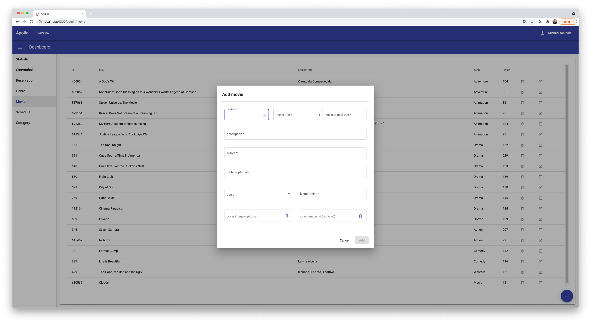

# Apollo Web

## Technologies
- TS
- Angular
- Angular Material UI
- OpenID Connect (Keycloak)
- using Rest Api (C# Backend)
## Dev
- Michael Neuhold (S1810307094@students.fh-hagenberg.at)

## Screenshots
Some impressions of the application...

